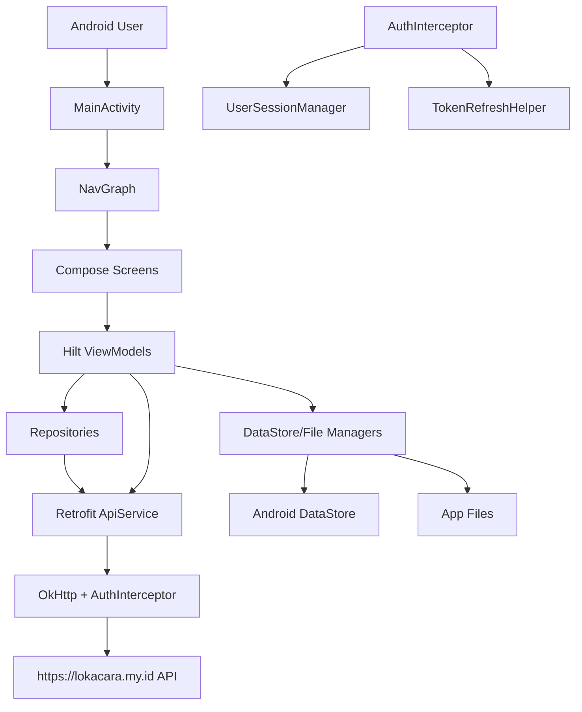
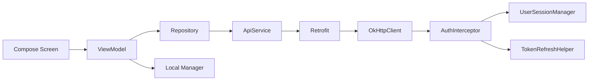
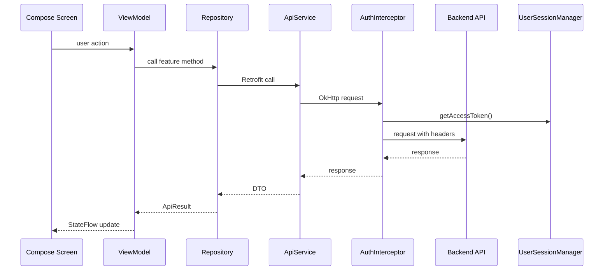
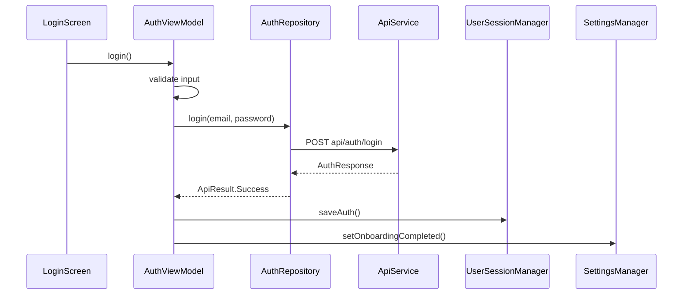

# 01 Architecture

Lokacara Mobile uses a layered Android architecture:

`Compose UI -> ViewModel -> Repository/API/local managers -> backend API or local storage`.

## System Architecture

Evidence:
- File: `app/src/main/java/com/app/lokacara/MainActivity.kt`
- Class: `MainActivity`
- Function: `onCreate()`
- Explanation: initializes Compose, global snackbar state, login/onboarding state, and `NavGraph`.
- File: `app/src/main/java/com/app/lokacara/ui/navigation/NavGraph.kt`
- Function: `NavGraph()`
- Explanation: chooses start destination from login and onboarding state.

## Dependency Flow

Dependency injection uses Hilt:
- `LokacaraApp` is annotated with `@HiltAndroidApp`.
- `MainActivity` is annotated with `@AndroidEntryPoint`.
- ViewModels are annotated with `@HiltViewModel`.
- Global providers are in `AppModule` and `NetworkModule`.

Evidence:
- File: `app/src/main/java/com/app/lokacara/LokacaraApp.kt`
- Class: `LokacaraApp`
- Explanation: enables Hilt at application level.
- File: `app/src/main/java/com/app/lokacara/di/AppModule.kt`
- Object: `AppModule`
- Explanation: provides local managers and Coil `ImageLoader`.
- File: `app/src/main/java/com/app/lokacara/data/remote/NetworkModule.kt`
- Object: `NetworkModule`
- Explanation: provides Moshi, OkHttp, Retrofit, and `ApiService`.

## Request Flow

Evidence:
- File: `app/src/main/java/com/app/lokacara/data/remote/AuthInterceptor.kt`
- Class: `AuthInterceptor`
- Function: `intercept()`
- Explanation: adds `Accept: application/json`, attaches bearer token if available, refreshes token on 401, and retries.
- File: `app/src/main/java/com/app/lokacara/data/remote/ApiResult.kt`
- Function: `safeApiCall()`
- Explanation: converts Retrofit/IO errors into `ApiResult.Error`.

## Data Flow

Remote data:
- `ApiService` returns DTOs.
- Repository wraps calls with `ApiResult`.
- Mapper functions convert DTOs to UI models.
- ViewModel exposes `StateFlow`.
- Compose screens observe state with `collectAsState()`.

Local data:
- Session and token: `UserSessionManager`
- Settings and onboarding state: `SettingsManager`
- Bookmark IDs: `BookmarkManager`
- Event draft: `DraftManager`
- Files: `FileStorageManager`
- Home feed/category memory cache: `HomeCache`

Evidence:
- File: `app/src/main/java/com/app/lokacara/data/remote/Mappers.kt`
- Functions: `EventDto.toEvent()`, `RegistrationDto.toUpcomingEvent()`, `RegistrationDto.toHistoryEvent()`
- Explanation: maps backend DTOs to UI models.
- File: `app/src/main/java/com/app/lokacara/data/UserSessionManager.kt`
- Functions: `saveAuth()`, `getAccessToken()`, `encryptToken()`
- Explanation: stores and encrypts the access token.

## Main Feature Flows

### Login

Evidence:
- File: `app/src/main/java/com/app/lokacara/viewmodel/AuthViewModel.kt`
- Functions: `login()`, `saveAuthenticatedSession()`
- Explanation: validates input and persists session only if the auth response contains a valid token and user.

### Home Feed

Evidence:
- File: `app/src/main/java/com/app/lokacara/viewmodel/HomeViewModel.kt`
- Function: `loadData()`
- Explanation: loads cached events, refreshes from backend, maps DTOs to UI models, sorts popular events by view count, and syncs bookmark state.
- File: `app/src/main/java/com/app/lokacara/repository/HomeRepository.kt`
- Functions: `getFeedEvents()`, `getCategories()`
- Explanation: uses `HomeCache` and backend API.

### Create Event

Evidence:
- File: `app/src/main/java/com/app/lokacara/viewmodel/CreateEventViewModel.kt`
- Function: `publish()`
- Explanation: validates form data, creates multipart request parts, compresses poster when needed, and calls `apiService.createEvent()`.

### Registration and QR

Evidence:
- File: `app/src/main/java/com/app/lokacara/viewmodel/EventDetailViewModel.kt`
- Functions: `joinEvent()`, `leaveEvent()`, `loadQrTicket()`
- Explanation: registers/unregisters the user and loads QR ticket data.
- File: `app/src/main/java/com/app/lokacara/viewmodel/QrScanViewModel.kt`
- Function: `scan()`
- Explanation: sends a QR token to the organizer attendance scan endpoint.

## External Integrations

- Backend API: `https://lokacara.my.id/`
- Google Maps key through `MAPS_API_KEY`
- Google Web Client ID through `GOOGLE_WEB_CLIENT_ID`
- Google Maps, Places, Location, and Sign-In SDKs
- Coil image loading

Evidence:
- File: `app/build.gradle.kts`
- Explanation: reads Google keys and declares Google dependencies.
- File: `app/src/main/java/com/app/lokacara/data/remote/ImageUrlProvider.kt`
- Class: `ImageUrlProvider`
- Explanation: builds backend asset URLs for posters, avatars, and certificates.

## Unverified Findings

- Backend framework, server-side authorization rules, queue behavior, and database schema are not available in this repository.
- The backend appears to expose Laravel-like API paths, but the framework cannot be verified from mobile source code alone.
