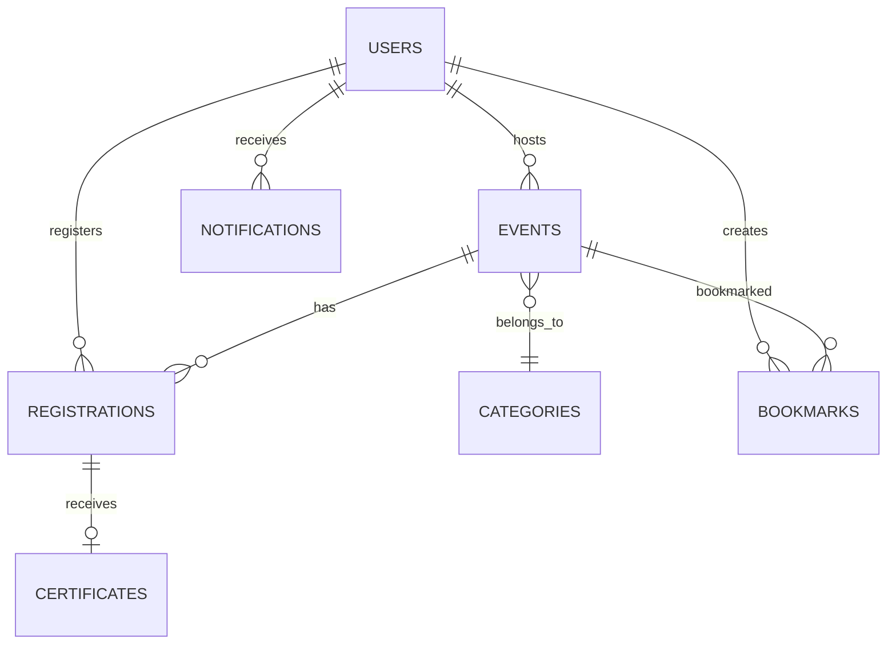

# 02 Database and Storage Analysis

No local relational database was found in this repository. The verified persistence mechanisms are Android DataStore Preferences, app file storage, and in-memory cache.

## Verified Local Storage

### DataStore: `user_session`

Keys:
- `is_logged_in`
- `name`
- `email`
- `phone`
- `location`
- `profile_image_path`
- `access_token`
- `user_id`
- `user_role`

Rules:
- `saveAuth()` marks the user as logged in and stores an encrypted token.
- `logout()` clears all user-session preferences.
- New tokens are encrypted with AES/GCM through Android Keystore alias `lokacara_session_token`.
- Tokens without prefix `v1:` are returned as legacy plaintext tokens.

Evidence:
- File: `app/src/main/java/com/app/lokacara/data/UserSessionManager.kt`
- Class: `UserSessionManager`
- Functions: `saveAuth()`, `logout()`, `encryptToken()`, `decryptToken()`

### DataStore: `settings`

Keys:
- `notifications_enabled`, default `true`
- `is_onboarding_completed`, default `false`

Evidence:
- File: `app/src/main/java/com/app/lokacara/data/SettingsManager.kt`
- Class: `SettingsManager`
- Functions: `setNotificationsEnabled()`, `setOnboardingCompleted()`

### DataStore: `onboarding`

Keys:
- `is_completed`, default `false`

Note:
- Routing uses `SettingsManager.isOnboardingCompleted`, not `OnboardingManager.isCompleted`.

Evidence:
- File: `app/src/main/java/com/app/lokacara/data/OnboardingManager.kt`
- Class: `OnboardingManager`
- File: `app/src/main/java/com/app/lokacara/viewmodel/MainViewModel.kt`
- Class: `MainViewModel`

### DataStore: `bookmarks`

Keys:
- `bookmarked_ids`: `Set<String>`

Rules:
- Bookmark state is stored locally as string event IDs.
- `toggleBookmark()` uses a `Mutex` to serialize local updates.

Evidence:
- File: `app/src/main/java/com/app/lokacara/data/BookmarkManager.kt`
- Class: `BookmarkManager`
- Function: `toggleBookmark()`

### DataStore: `event_draft`

Keys:
- `draft_nama_event`
- `draft_penyelenggara`
- `draft_waktu_mulai`
- `draft_waktu_selesai`
- `draft_is_online`
- `draft_aplikasi_tempat`
- `draft_alamat`
- `draft_deskripsi`
- `draft_kuota`
- `draft_category_id`
- `draft_latitude`
- `draft_longitude`
- `draft_poster_uri`
- `draft_has`

Rules:
- Draft exists only when `draft_has == true`.
- Default event type is online.
- Default capacity is `50`.
- `deleteDraft()` only sets `draft_has` to false.
- Poster URI is intentionally not restored because `content://` URIs may expire.

Evidence:
- File: `app/src/main/java/com/app/lokacara/data/DraftManager.kt`
- Class: `DraftManager`
- File: `app/src/main/java/com/app/lokacara/viewmodel/CreateEventViewModel.kt`
- Function: `loadDraft()`

## File Storage

File storage is used for event posters, profile photos, and certificates.

Evidence:
- File: `app/src/main/java/com/app/lokacara/data/FileStorageManager.kt`
- Class: `FileStorageManager`
- Functions: `saveUriToFile()`, `saveEventPoster()`, `saveProfilePhoto()`, `saveCertificate()`, `deleteCertificate()`

## In-Memory Cache

`HomeCache` stores:
- `cachedEvents`
- `cachedCategories`
- `cacheTimestamp`

The cache becomes stale after 30 seconds.

Evidence:
- File: `app/src/main/java/com/app/lokacara/data/HomeCache.kt`
- Class: `HomeCache`
- Property: `isStale`

## Backend Data Model Inferred from DTOs

This is not a verified database schema. It is inferred from client DTOs and API responses.

Inferred entities:
- `UserDto`
- `EventDto`
- `CategoryDto`
- `LocationDto`
- `RegistrationDto`
- `CertificateDto`
- `NotificationItemDto`
- Bookmark response containing `EventDto` items

Evidence:
- File: `app/src/main/java/com/app/lokacara/data/remote/dto/AuthDtos.kt`
- Class: `UserDto`
- File: `app/src/main/java/com/app/lokacara/data/remote/dto/EventDtos.kt`
- Classes: `EventDto`, `CategoryDto`, `LocationDto`
- File: `app/src/main/java/com/app/lokacara/data/remote/dto/DashboardDtos.kt`
- Classes: `RegistrationDto`, `CertificateDto`
- File: `app/src/main/java/com/app/lokacara/data/remote/dto/NotificationDtos.kt`
- Class: `NotificationItemDto`

## Constraints, Indexes, Migrations, and Seeders

Verified:
- No local database constraints, indexes, migrations, or seeders were found.

Client-side constraints:
- Event title max length: 255.
- Event description max length: 5000.
- Capacity: 1 to 100000.
- Avatar max size: 5 MB.
- Poster max size before compression: 10 MB.

Evidence:
- File: `app/src/main/java/com/app/lokacara/viewmodel/CreateEventViewModel.kt`
- Function: `publish()`
- File: `app/src/main/java/com/app/lokacara/repository/ProfileRepository.kt`
- Function: `uploadAvatar()`

## Unverified Findings

- Actual backend table names, foreign keys, indexes, cascade rules, and seeders cannot be verified from this repository.
- The ERD above is inferred only from mobile DTOs.
