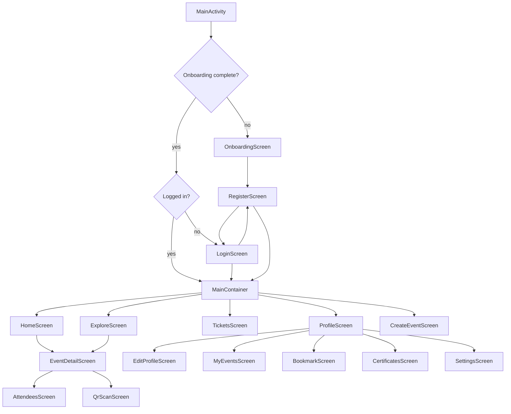

# 05 Frontend / Mobile Analysis

This repository contains a native Android frontend built with Jetpack Compose. No web frontend was found.

## Entry Point

- `LokacaraApp` enables Hilt.
- `MainActivity` is the launcher activity.
- `MainViewModel` exposes login and onboarding state.
- `NavGraph` chooses the first screen.

Evidence:
- File: `app/src/main/AndroidManifest.xml`
- Activity: `.MainActivity`
- File: `app/src/main/java/com/app/lokacara/MainActivity.kt`
- Class: `MainActivity`
- File: `app/src/main/java/com/app/lokacara/viewmodel/MainViewModel.kt`
- Class: `MainViewModel`

## Routing

Root routing:
- If onboarding is not complete: `onboarding`
- If logged in: `main_container`
- Otherwise: `login`

Main routes:
- `home`
- `explore?category={category}`
- `event_detail?eventId={eventId}`
- `create_event`
- `tickets`
- `profile`
- `notification`
- `edit_profile`
- `my_events`
- `saved_events`
- `certificates`
- `settings`
- `about`
- `bookmark`
- `change_password`
- `help_center`
- `terms_conditions`
- `privacy_policy`
- `attendees/{eventId}`
- `qr_scan/{eventId}`

Evidence:
- File: `app/src/main/java/com/app/lokacara/ui/navigation/Screen.kt`
- Class: `Screen`
- File: `app/src/main/java/com/app/lokacara/ui/navigation/NavGraph.kt`
- Functions: `NavGraph()`, `MainContainer()`

## Navigation Diagram

## Screens

Screen files:
- `AboutScreen.kt`
- `AttendeesScreen.kt`
- `BookmarkScreen.kt`
- `CertificatesScreen.kt`
- `ChangePasswordScreen.kt`
- `CreateEventScreen.kt`
- `EditProfileScreen.kt`
- `EventDetailScreen.kt`
- `ExploreScreen.kt`
- `HelpCenterScreen.kt`
- `HomeScreen.kt`
- `loginScreen.kt`
- `MyEventsScreen.kt`
- `NotificationScreen.kt`
- `OnboardingScreen.kt`
- `PrivacyPolicyScreen.kt`
- `ProfileScreen.kt`
- `QrScanScreen.kt`
- `registerScreen.kt`
- `SavedEventsScreen.kt`
- `SettingsScreen.kt`
- `TermsConditionsScreen.kt`
- `TicketsScreen.kt`

Evidence:
- Directory: `app/src/main/java/com/app/lokacara/ui/screens`

## Components

Main component files:
- `BottomNavbar.kt`
- `DetailComponents.kt`
- `EventCard.kt`
- `ExploreComponents.kt`
- `HomeComponents.kt`
- `lokacaraComponents.kt`
- `MapSearchPicker.kt`
- `NotificationComponents.kt`
- `ProfileComponents.kt`
- `Shimmer.kt`
- `SnackbarManager.kt`
- `TicketComponents.kt`

Evidence:
- Directory: `app/src/main/java/com/app/lokacara/ui/components`
- File: `app/src/main/java/com/app/lokacara/ui/components/BottomNavbar.kt`
- Function: `BottomNavbar()`
- File: `app/src/main/java/com/app/lokacara/ui/components/TicketComponents.kt`
- Functions: `QrCodeDialog()`, `createQrBitmap()`

## State Management

Patterns:
- ViewModels expose `StateFlow`.
- Screens collect state with `collectAsState()`.
- Hilt provides ViewModels with `hiltViewModel()`.
- Temporary UI state uses `remember` and `LaunchedEffect`.

Evidence:
- File: `app/src/main/java/com/app/lokacara/viewmodel/AuthViewModel.kt`
- File: `app/src/main/java/com/app/lokacara/ui/screens/CreateEventScreen.kt`
- File: `app/src/main/java/com/app/lokacara/ui/screens/TicketsScreen.kt`

## API Integration by Area

| Area | ViewModel | API/Repository |
|---|---|---|
| Login/Register | `AuthViewModel` | `AuthRepository` |
| Home | `HomeViewModel` | `HomeRepository`, `ApiService` |
| Explore | `ExploreViewModel` | `ExploreRepository`, `ApiService` |
| Event detail | `EventDetailViewModel` | `EventDetailRepository`, `ApiService` |
| Create event | `CreateEventViewModel` | `ApiService`, `ExploreRepository` |
| Tickets | `TicketsViewModel` | `TicketsRepository`, `ApiService` |
| Profile | `ProfileViewModel` | `ProfileRepository` |
| Settings | `SettingsViewModel` | `ApiService`, local managers |
| Notifications | `NotificationViewModel` | `NotificationRepository` |
| Attendees | `AttendeesViewModel` | `ApiService` |
| QR scan | `QrScanViewModel` | `ApiService` |

## Forms and Validation

Auth:
- Login requires valid email and non-empty password.
- Register requires name, valid email, password minimum length 6, matching confirmation, and accepted terms.
- Forgot password requires valid email.

Create event:
- Title required, max 255.
- Description required, max 5000.
- Category required.
- Start and end time required.
- End time must be after start time.
- Capacity must be 1 to 100000.
- Online events require platform and link.
- Offline events require coordinates.
- Poster max size is 10 MB before compression.

Settings:
- Delete account requires password.
- Notification setting rolls back on API sync failure.

QR scan:
- QR token cannot be empty.
- Event id must be set.

Evidence:
- File: `app/src/main/java/com/app/lokacara/viewmodel/AuthViewModel.kt`
- File: `app/src/main/java/com/app/lokacara/viewmodel/CreateEventViewModel.kt`
- File: `app/src/main/java/com/app/lokacara/viewmodel/SettingsViewModel.kt`
- File: `app/src/main/java/com/app/lokacara/viewmodel/QrScanViewModel.kt`

## Unverified Findings

- Some `ApiService` methods exist without verified screen usage, including `resetPassword()`, `getConfigTabs()`, update/delete event, and organizer certificate endpoints.
- `OnboardingManager` exists, but root navigation uses `SettingsManager.isOnboardingCompleted`.
