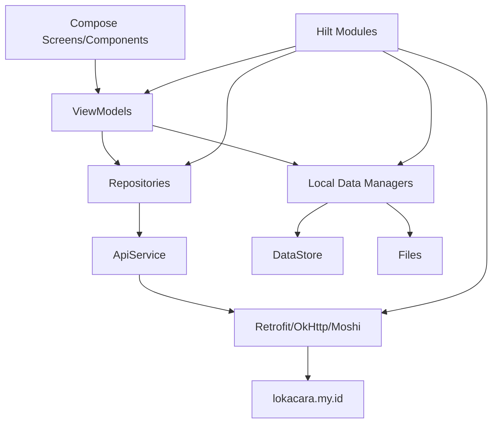

# 09 Development Guide

## Adding a New Feature

Recommended flow:

1. Add DTOs in `app/src/main/java/com/app/lokacara/data/remote/dto` if the feature needs API data.
2. Add the Retrofit method in `ApiService`.
3. Add or extend a repository.
4. Add or update a ViewModel.
5. Add screen UI in `ui/screens` and reusable UI in `ui/components`.
6. Add routes in `Screen.kt` and `NavGraph.kt` if the feature has a new page.
7. Add a DataStore/file manager only if local persistence is needed.

Evidence:
- File: `app/src/main/java/com/app/lokacara/data/remote/ApiService.kt`
- File: `app/src/main/java/com/app/lokacara/ui/navigation/Screen.kt`
- File: `app/src/main/java/com/app/lokacara/ui/navigation/NavGraph.kt`

## Adding an Endpoint

Steps:

1. Define request/response DTOs.
2. Add a method to `ApiService`.
3. Wrap the call in a repository with `safeApiCall()`.
4. Call the repository from the ViewModel.
5. Add client-side validation in the ViewModel when the endpoint is used by a form.
6. Update `docs/04_api.md` and `docs/07_business_rules.md` if behavior changes.

Evidence:
- File: `app/src/main/java/com/app/lokacara/repository/NotificationRepository.kt`
- Function: `getNotifications()`
- Explanation: this is the clean repository wrapper pattern.

Note:
- Avoid adding new direct `ApiService` calls in ViewModels unless necessary. Existing direct calls are technical debt.

## Adding a Table or Storage

This mobile repository has no local relational database.

For backend tables:
- Add migrations/models/controllers in the backend repository, not here.
- Update mobile DTOs and `ApiService` after the backend contract is stable.

For local mobile storage:
- Use DataStore for lightweight key-value data.
- Follow `SettingsManager`, `UserSessionManager`, or `DraftManager`.
- Consider Room only if relational/offline data becomes necessary.

Evidence:
- File: `app/src/main/java/com/app/lokacara/data/SettingsManager.kt`
- File: `app/src/main/java/com/app/lokacara/data/DraftManager.kt`
- File: `app/build.gradle.kts`
- Explanation: Room is not currently included.

## Dependency Map



## High-Risk Areas

Auth and token refresh:
- `AuthInterceptor` uses `runBlocking`.
- `TokenRefreshHelper` duplicates base URL and client setup.

Create event:
- Form validation, image compression, draft persistence, and multipart request construction are all in one ViewModel.

Bookmark sync:
- Logic exists in several classes with different rollback behavior.

Date/time:
- Filtering and ticket classification use string parsing and manual date comparisons.

Evidence:
- File: `app/src/main/java/com/app/lokacara/data/remote/AuthInterceptor.kt`
- File: `app/src/main/java/com/app/lokacara/data/remote/TokenRefreshHelper.kt`
- File: `app/src/main/java/com/app/lokacara/viewmodel/CreateEventViewModel.kt`
- File: `app/src/main/java/com/app/lokacara/viewmodel/ExploreViewModel.kt`
- File: `app/src/main/java/com/app/lokacara/viewmodel/HomeViewModel.kt`

## Safer Areas to Modify

Relatively safe:
- Static content screens: About, Help Center, Terms, Privacy Policy.
- Theme colors/typography if no API/state contracts change.
- Pure UI layout changes that do not alter callback contracts.
- Documentation.

Evidence:
- File: `app/src/main/java/com/app/lokacara/ui/screens/AboutScreen.kt`
- File: `app/src/main/java/com/app/lokacara/ui/screens/PrivacyPolicyScreen.kt`

## Debugging Guide

Network/API:
- Check `MAPS_API_KEY` and `GOOGLE_WEB_CLIENT_ID`.
- Check Logcat tag `OkHttp` for HTTP logging when verbose logging is enabled.
- Check `safeApiCall()` error mapping.
- For 401, inspect `AuthInterceptor` and `TokenRefreshHelper`.

Auth/session:
- Inspect `UserSessionManager.userSession`.
- Confirm `saveAuth()` is called after valid login response.
- Confirm `logout()` clears DataStore.

Bookmark:
- Inspect DataStore key `bookmarked_ids`.
- Check backend calls to `api/bookmarks`.
- Saved events load server bookmarks first, then missing local IDs.

Create event:
- Verify multipart field names in `ApiService.createEvent()`.
- Verify validation in `CreateEventViewModel.publish()`.
- Test online and offline event modes.

Evidence:
- File: `app/src/main/java/com/app/lokacara/data/remote/ApiResult.kt`
- File: `app/src/main/java/com/app/lokacara/data/UserSessionManager.kt`
- File: `app/src/main/java/com/app/lokacara/data/BookmarkManager.kt`
- File: `app/src/main/java/com/app/lokacara/data/remote/ApiService.kt`

## Testing Guide

Commands:

```powershell
.\gradlew.bat testDebugUnitTest
.\gradlew.bat connectedDebugAndroidTest
.\gradlew.bat lintDebug
.\gradlew.bat assembleDebug
```

Existing tests:
- `ExampleUnitTest.kt`
- `ExampleInstrumentedTest.kt`

Recommended tests:
- Mapper/date/price formatting tests.
- Create event validation tests.
- Explore filter tests.
- Bookmark sync behavior tests.
- Instrumented tests for critical forms.

Evidence:
- File: `app/src/test/java/com/app/lokacara/ExampleUnitTest.kt`
- File: `app/src/androidTest/java/com/app/lokacara/ExampleInstrumentedTest.kt`

## Setup Requirements

Required:
- Android Studio or compatible Android SDK setup.
- Java 17 compatibility.
- `MAPS_API_KEY` for map features.
- `GOOGLE_WEB_CLIENT_ID` for Google Sign-In.

Evidence:
- File: `app/build.gradle.kts`

## Suggested Refactor Backlog

1. Centralize backend base URL.
2. Consolidate bookmark sync behavior.
3. Move direct `ApiService` calls out of ViewModels.
4. Unify onboarding persistence.
5. Extract date/time utilities.
6. Split create-event validation/media/upload responsibilities.

## Unverified Findings

- Production deployment, signing setup, release process, and backend environment cannot be verified from this repository.
